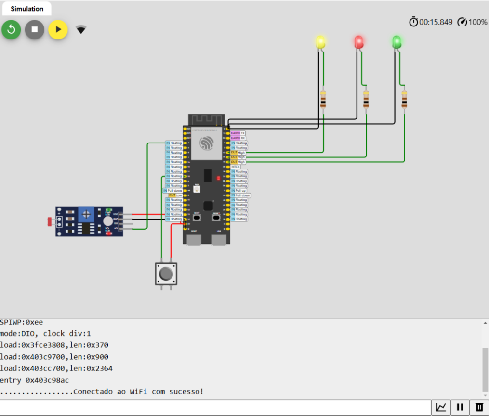
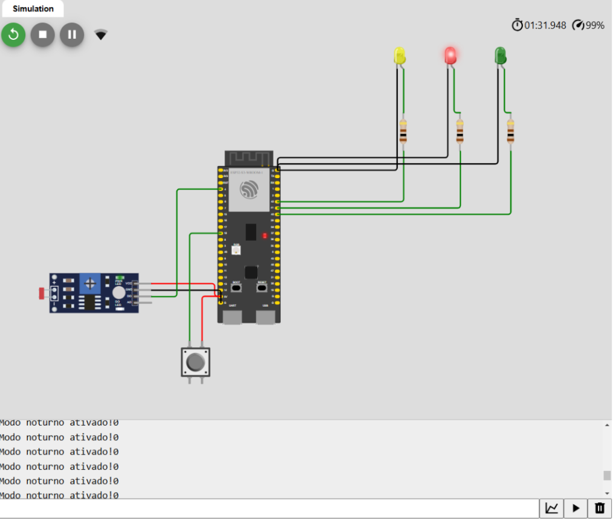

# M04-ProvaPratica

## Luiza Faria Petenazzi

O sistema pode ter alguns diferentes estados:
- Conectado ao Wifi
- Não conectado ao Wifi
- Semafaro funcionando no modo convencional
- Semaforo funcionando em modo noturno

A seguir, duas imagens de como ficou finalizado o projeto:

    Figura 1 - Portas utilizadas
     
    
     
    Fonte: Material produzido pelos autores (2024)

    Figura 2 - Projeto finalizado
     
    
     
    Fonte: Material produzido pelos autores (2024)

